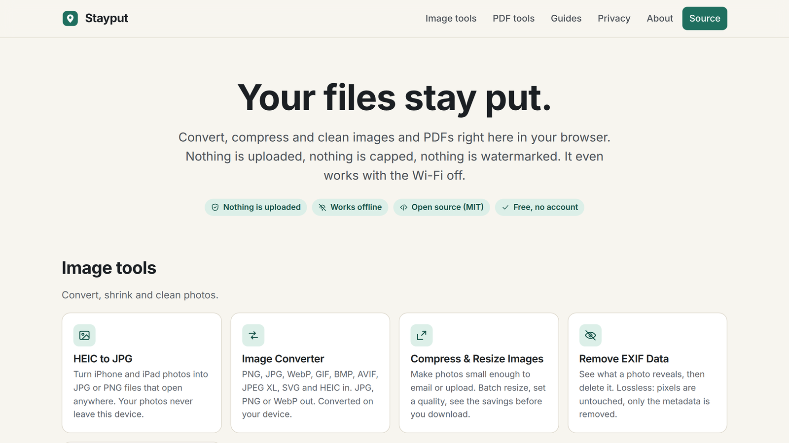
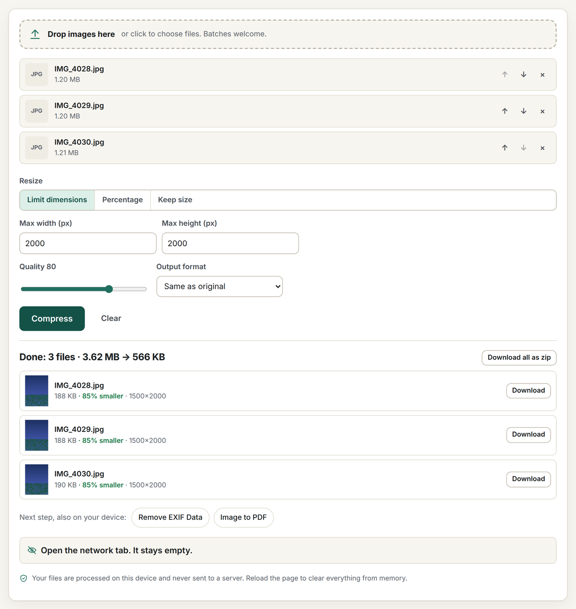

<div align="center">

<a href="https://stayput.dev"></a>

# Stayput

**Your files stay put.**

Free, open-source image and PDF tools that run entirely in your browser.<br>
Nothing is uploaded, there are no accounts or limits, and it works offline.

**[Open stayput.dev](https://stayput.dev)** · [Tools](#tools) · [Verify the claim](#open-the-network-tab-it-stays-empty) · [How it works](#how-it-works) · [MCP server](#mcp-server) · [Privacy](https://stayput.dev/privacy)

[](https://github.com/keenanlk/stayput/actions/workflows/ci.yml)
[](LICENSE)
[](#how-it-works)

<a href="https://stayput.dev"></a>

</div>

Convert HEIC photos from an iPhone, merge, split, sign and compress PDFs, shrink images and strip GPS and EXIF data. Every tool is a static page and a bit of JavaScript and WebAssembly that does the work in your tab. There is no server that could receive your files.

## Open the network tab. Your files never appear in it.

That is the whole pitch, and you can check it in three ways:

1. **Watch the network.** Open your browser's developer tools (F12, or Cmd-Option-I on a Mac), pick the Network tab, open any tool and drop a file. You will see requests for the page's own code, the site's own decoder files on the pages that need them, and one anonymous page count. You will never see a request carrying your file, because there is nowhere for it to go. Every tool page also counts its own requests after you add files and shows you the list.
2. **Turn the network off.** Load a tool, switch to airplane mode, and use it. It keeps working, because after one visit the site is cached by a service worker and the work happens in your tab.
3. **Read the code.** This repository is the site. It builds to static HTML, CSS and JavaScript with no backend; the deploy has no server-side code at all. The [privacy page](https://stayput.dev/privacy) lists every request the site makes.

<p align="center"></p>

## Tools

| Images | PDFs |
| --- | --- |
| [HEIC to JPG or PNG](https://stayput.dev/tools/heic-to-jpg) (batch, keep or drop EXIF) | [Merge PDF](https://stayput.dev/tools/merge-pdf) |
| [Convert images](https://stayput.dev/tools/convert-image) (PNG, JPG, WebP, AVIF, JPEG XL, HEIC, SVG in; JPG, PNG, WebP out) | [Split PDF / extract pages](https://stayput.dev/tools/split-pdf) |
| [Compress and resize images](https://stayput.dev/tools/compress-image) (plus [Compress PNG](https://stayput.dev/tools/compress-png), transparency kept, and [Compress GIF](https://stayput.dev/tools/compress-gif)) | [Compress PDF](https://stayput.dev/tools/compress-pdf) (lossless cleanup, image recompression, or flatten) |
| [Remove EXIF and GPS data](https://stayput.dev/tools/strip-exif) (lossless, no re-encode) | [Rotate PDF pages](https://stayput.dev/tools/rotate-pdf) |
| [Crop image](https://stayput.dev/tools/crop-image) (ratios, exact pixels, circle) | [Images to PDF](https://stayput.dev/tools/image-to-pdf) |
| [EXIF viewer](https://stayput.dev/tools/exif-viewer) (location, camera, date and every field) | [PDF to images](https://stayput.dev/tools/pdf-to-image) (PNG, JPG or one multi-page TIFF) |
| [Video to GIF](https://stayput.dev/tools/video-to-gif) (MP4, MOV, WebM; trim, size, frame rate) | [Reorder and delete pages](https://stayput.dev/tools/reorder-pdf) |
| [Blur or pixelate image](https://stayput.dev/tools/blur-image) (faces, plates, text; blur, pixelate or black box) | [Sign PDF](https://stayput.dev/tools/sign-pdf) (draw or type, place on any page) |
| [Rotate or flip image](https://stayput.dev/tools/rotate-image) (quarter turns, mirror, batch) | [Add page numbers](https://stayput.dev/tools/pdf-page-numbers) |
| [Video or audio to MP3](https://stayput.dev/tools/video-to-mp3) (MP4, MOV, M4A, WAV; or to WAV) | [PDF to Word or text](https://stayput.dev/tools/pdf-to-word) (paragraphs and headings, not layout) |
| [Image to text (OCR)](https://stayput.dev/tools/image-to-text) (photos, screenshots, scans; copy or .txt) | [Unlock PDF](https://stayput.dev/tools/unlock-pdf) (remove a password you know, or print/copy restrictions) |
| [Color picker from image](https://stayput.dev/tools/color-picker) (HEX, RGB, HSL; main-colour palette) | [Password protect PDF](https://stayput.dev/tools/protect-pdf) (AES-256) |
| [GIF to MP4](https://stayput.dev/tools/gif-to-mp4) (animated GIF to video, up to 90% smaller) | [Extract images from PDF](https://stayput.dev/tools/extract-pdf-images) (every picture at its stored size) |
| [Compress video](https://stayput.dev/tools/compress-video) (MP4, MOV, WebM; fit 10 MB for Discord or 25 MB for email) | |
| [Video to MP4](https://stayput.dev/tools/video-to-mp4) (MOV, MKV, WebM; H.264 copied with no quality loss) | |
| [Trim video](https://stayput.dev/tools/trim-video) (cut a clip without re-encoding) | |
| [Mute video](https://stayput.dev/tools/mute-video) (remove the sound, picture copied untouched) | |
| [Resize video](https://stayput.dev/tools/resize-video) (1080p, 720p, custom size) | |
| [Rotate video](https://stayput.dev/tools/rotate-video) (90°, 180°, flip) | |
| [Crop video](https://stayput.dev/tools/crop-video) (any box, 9:16, 1:1) | |
| [Change video speed](https://stayput.dev/tools/video-speed) (0.25× to 8×, pitch kept) | |
| [Merge videos](https://stayput.dev/tools/merge-videos) (join clips into one MP4) | |
| [Add audio to video](https://stayput.dev/tools/add-audio-to-video) (music or voice-over, picture copied untouched) | |
| [Reverse video](https://stayput.dev/tools/reverse-video) (play a clip backwards) | |
| [Video to JPG](https://stayput.dev/tools/video-to-jpg) (save frames as JPG or PNG) | |
| [Trim audio](https://stayput.dev/tools/trim-audio) (cut MP3, WAV, M4A with a waveform) | |
| [Screen recorder](https://stayput.dev/tools/screen-recorder) (screen, window or tab, with sound and microphone) | |
| [Collage maker](https://stayput.dev/tools/collage-maker) (grids, side by side, stitched screenshots) | |
| [Split image](https://stayput.dev/tools/split-image) (Instagram grids and carousels) | |
| [Add text to image](https://stayput.dev/tools/add-text-to-image) (captions, memes, watermarks) | |
| [AI image upscaler](https://stayput.dev/tools/upscale-image) (2×, 3× or 4× with Real-ESRGAN, on the device) | |
| [Remove object from photo](https://stayput.dev/tools/remove-object) (paint over it, MI-GAN fills it in on the device) | |
| [Adjust photo](https://stayput.dev/tools/adjust-image) (brightness, contrast, saturation, warmth, sharpen, invert) | |
| [Compress audio](https://stayput.dev/tools/compress-audio) (smaller MP3 or OGG, or fit a size limit) | |
| [Volume booster](https://stayput.dev/tools/volume-booster) (louder, quieter or normalized audio and video) | |
| [Pitch and speed changer](https://stayput.dev/tools/pitch-changer) (change key by semitones, speed up or slow down) | |
| [Audio converter](https://stayput.dev/tools/audio-converter) (MP3, WAV, FLAC, M4A, OGG) | |
| [QR code generator](https://stayput.dev/tools/qr-code-generator) (link, Wi-Fi, contact, email, phone; PNG or SVG) | |
| [Voice recorder](https://stayput.dev/tools/voice-recorder) (microphone to MP3, WAV or M4A) | |
| [Merge audio](https://stayput.dev/tools/merge-audio) (join MP3, WAV, M4A with silence or crossfades) | |
| [Metronome](https://stayput.dev/tools/metronome) (any time signature, subdivisions, tap tempo) | |
| [GIF maker](https://stayput.dev/tools/gif-maker) (animated GIF from photos or screenshots; timing, size, loop, there-and-back) | |
| [Image to SVG](https://stayput.dev/tools/image-to-svg) (trace PNG or JPG into vector shapes; black and white, logo or detailed) | |
| [Transcribe audio to text](https://stayput.dev/tools/transcribe) (Whisper on your device; text, SRT or WebVTT; 16+ languages) | |
| [Add subtitles to video](https://stayput.dev/tools/add-subtitles-to-video) (captions from the speech or your SRT, burned into the picture) | |
| [Vocal remover](https://stayput.dev/tools/vocal-remover) (karaoke instrumental or acapella, AI model on your device) | |
| [Video background remover](https://stayput.dev/tools/video-background-remover) (blur, colour or a picture behind the person) | |
| [OCR PDF](https://stayput.dev/tools/ocr-pdf) (make a scanned PDF searchable) | |
| [Document scanner](https://stayput.dev/tools/document-scanner) (phone photos of paper to a clean PDF) | |
| [EPUB to PDF](https://stayput.dev/tools/epub-to-pdf) (DRM-free ebooks to a paginated PDF) | |
| [PDF to EPUB](https://stayput.dev/tools/pdf-to-epub) (reflowable ebook from a PDF's text) | |
| [Remove silence](https://stayput.dev/tools/remove-silence) (shorten pauses, trim quiet ends) | |
| [Remove background noise](https://stayput.dev/tools/remove-noise) (hiss, hum, fans and traffic out of voice recordings and videos) | |
| [Blur faces in video](https://stayput.dev/tools/blur-face-video) (automatic, frame by frame; blur, pixelate, box or emoji) | |
| [Resize PDF pages](https://stayput.dev/tools/resize-pdf) (A4, Letter, Legal, A3, A5, Tabloid; content scaled to fit, text stays text) | |
| [Flatten PDF](https://stayput.dev/tools/flatten-pdf) (form fields, comments, stamps and signatures into the page; text stays selectable) | |
| [Fill PDF form](https://stayput.dev/tools/fill-pdf-form) (type into fillable fields, tick boxes, optional flatten) | |
| [Online tuner](https://stayput.dev/tools/tuner) (guitar, bass, ukulele, violin, chromatic; reference notes) | |
| [Mic test](https://stayput.dev/tools/mic-test) (level meter, verdict, record and play back) | |
| [Webcam test](https://stayput.dev/tools/webcam-test) (preview, real resolution and frame rate, snapshot) | |
| [Audio to video](https://stayput.dev/tools/audio-to-video) (MP3 plus a cover picture to MP4; 16:9, square, 9:16) | |

Plus dedicated pages for the jobs people search for: image conversions such as [HEIC to PNG](https://stayput.dev/heic-to-png), [PNG to JPG](https://stayput.dev/png-to-jpg), [WebP to PNG](https://stayput.dev/webp-to-png), [AVIF to JPG](https://stayput.dev/avif-to-jpg) and [JXL to PNG](https://stayput.dev/jxl-to-png); tool presets such as [JPG to PDF](https://stayput.dev/jpg-to-pdf), [PDF to JPG](https://stayput.dev/pdf-to-jpg), [Combine PDF](https://stayput.dev/combine-pdf), [Resize image](https://stayput.dev/resize-image), [Crop to circle](https://stayput.dev/crop-image-to-circle) and [Remove location from photos](https://stayput.dev/remove-location-from-photos); and [guides](https://stayput.dev/guides) that answer the question behind the tool ("is it safe to merge PDFs online?", "how do I remove location data from photos?").

## MCP server

Stayput also ships as a local [Model Context Protocol](https://modelcontextprotocol.io) server, [`stayput-mcp`](mcp/), so an LLM client can call the same PDF and photo tools as tool calls, still with no network access and no uploads:

```json
{ "mcpServers": { "stayput": { "command": "npx", "args": ["-y", "stayput-mcp"] } } }
```

See [`mcp/README.md`](mcp/README.md) for the full tool list, or [stayput.dev/mcp](https://stayput.dev/mcp).

## How it works

The site is a static [Astro](https://astro.build) build: one page per tool, a shared tool shell, and a TypeScript module per tool that does the work in the tab. The MCP server (above) is the one part of this repo that does run as a local process; everything else described below is the browser-only website.

- **HEIC decoding**: [heic-to](https://github.com/hoppergee/heic-to), a WebAssembly build of libheif, served by the site itself from `/vendor/` (copied out of node_modules at build time by `scripts/vendor.mjs`). The request fetches only the decoder; no image data is sent.
- **PDF editing**: [pdf-lib](https://pdf-lib.js.org) for merge, split, rotate, reorder, page numbers (standard fonts, nothing embedded), signature stamps, image embedding and rewriting image streams.
- **PDF to Word**: pdf.js reads the positioned text runs; `src/lib/pdftext.ts` rebuilds lines, paragraphs and headings and `src/lib/docx.ts` writes a minimal Office Open XML document with fflate. Text and structure only, no layout.
- **PDF rendering**: [pdf.js](https://mozilla.github.io/pdf.js/) (legacy build for wide browser support) on a dedicated web worker.
- **Image resize and encode**: the canvas API, with stepped downscaling for sharp results.
- **Encrypted PDFs**: many PDFs carry "owner" encryption with an empty user password (statements, forms with printing restrictions). pdf-lib cannot read those streams, so every PDF tool first checks the trailer for `/Encrypt` and, when found, runs [qpdf](https://github.com/qpdf/qpdf) compiled to WebAssembly (`@neslinesli93/qpdf-wasm`, served from `/vendor/` and loaded only when needed) to strip the encryption in the tab. Files with a user password prompt for it once; outputs are written without encryption. See `src/lib/unlock.ts`.
- **JPEG XL and AVIF decoding**: the browser's own decoder when it has one (AVIF everywhere, JXL in Safari); otherwise the [jSquash](https://github.com/jamsinclair/jSquash) WebAssembly builds of libjxl and libavif, served from `/vendor/` like the HEIC decoder. Tool pages that accept these formats ask the service worker to cache the decoders they may need (only JXL/AVIF decoders the browser lacks) and mark `<html data-decoders="cached">` when they are in, so they work offline after one visit; the service worker does not precache them for every visitor because together they are about 6 MB. See `src/lib/vendor.ts`.
- **Signatures**: drawn on a canvas with pointer events (pressure-aware for pens) or typed in the self-hosted Caveat font, cropped to a transparent PNG and placed at preview coordinates mapped into PDF user space, page rotation included.
- **EXIF removal**: a hand-written, lossless segment and chunk editor for JPEG, PNG and WebP in `src/lib/exif.ts`. It deletes only the metadata segments and writes the untouched image data back, so the pixels are identical and the file only gets smaller. It also extracts EXIF from HEIC containers so "keep metadata" works on HEIC conversions.
- **TIFF input**: [UTIF.js](https://github.com/photopea/UTIF.js) (`src/lib/tiff.ts`), bundled and loaded only when a TIFF is dropped, since only Safari decodes TIFF natively. Images to PDF turns every page of a multi-page TIFF into a PDF page.
- **Zip downloads**: [fflate](https://github.com/101arrowz/fflate) in the tab when there is more than one output.
- **Offline**: a service worker generated at build time (`src/pages/sw.js.ts`) caches every tool page, and `scripts/postbuild.mjs` writes the list of hashed assets and fonts into it so all tool code (including the on-demand pdf-lib and pdf.js chunks) is cached on the first visit. Pages are network-first so deploys show up immediately; assets are cache-first because their names are content-hashed, and assets from earlier deploys are pruned on activation.
- **Security headers**: the site ships a strict Content-Security-Policy. Scripts may load only from the site itself and the self-hosted analytics host; no third-party CDN is involved. `connect-src` is limited the same way, so even a bug could not send a file elsewhere.
- **Analytics**: a self-hosted, cookie-free [Umami](https://umami.is) counter records page views and three anonymous events (visit start, files added, tool run) with coarse buckets: tool, outcome, file count, size and duration ranges, the entry page and previous page on the site, a named referrer, the previous tool in the tab, and days-since-last-visit ranges computed from a note kept in the browser's own storage. No identifier, and never file names, types or contents. Every property is listed in `src/lib/analytics.ts` and on /privacy, and `tests/analytics.spec.ts` fails if an event gains an unlisted property or names a file. It honours Do Not Track. The numbers are kept private and used only to decide what to build next.

There is no backend and no cookies. See [`/privacy`](https://stayput.dev/privacy) for the full statement.

## Development

Requirements: Node 22+.

```bash
npm install
npm run dev              # http://localhost:4321
npm run build            # static output in dist/
npm run check-links      # fail on any broken internal link in dist/ (--external also checks outbound links)
node scripts/serve.mjs   # serve dist/ locally with clean URLs and the production headers
npm run check            # Astro and TypeScript checks
```

### Tests

End-to-end tests drive every tool in headless Chromium with generated fixtures (JPEG with EXIF and GPS, PNG, WebP, HEIC, multi-page PDFs, plus static encrypted and offset-box PDFs under `tests/fixtures/static`), then check the downloaded outputs. One test also asserts the privacy claim directly: after files are added, no request leaves the page except the stubbed analytics call. The local server (`scripts/serve.mjs`) applies the site's production headers, so tests run under the production Content-Security-Policy and a violation shows up as a console error.

```bash
pip install pillow pillow-heif            # once, for fixture generation
python3 tests/fixtures/make-fixtures.py && node tests/fixtures/make-pdf.mjs
npx playwright install chromium           # once
npm run build && npm test
```

Set `PLAYWRIGHT_CHROMIUM_PATH=/path/to/chrome` to use a preinstalled browser.

### Social images

`public/og.png` and `public/og/<slug>.png` are rendered from the page copy by `node scripts/make-og.mjs` (headless Chromium). Re-run it after changing a tool's heading or tagline and commit the result.

## Adding a tool

1. Add an entry to `src/data/tools.ts` (slug, SEO copy, steps, FAQ) and a paragraph to `src/data/engine.ts` saying what actually runs in the tab. These feed the home page, footer, sitemap, service worker, structured data and social image.
2. Create `src/pages/tools/<slug>.astro` using `ToolLayout` and put the option controls in the `options` slot.
3. Create `src/tools/<slug>.ts`, call `createShell({ process })` from `src/lib/shell.ts`, and return the output files.
4. Add a test to `tests/tools.spec.ts`, then run `node scripts/make-og.mjs`.

A format-pair landing page ("WebP to PNG") is just an entry in `src/data/pairs.ts`; the page, its social image and its sitemap entry are generated. A preset landing page for any other tool ("JPG to PDF", "Combine PDF") is an entry in `src/data/presets.ts` naming the base tool and its option defaults; the base tool's option controls live in `src/components/options/` so the tool page and its presets share one copy. A guide is an entry in `src/data/guides.ts` (sections, FAQ, the tools it points to); copy supports `[text](/path)` links and `**bold**`. Run `node scripts/make-og.mjs` after adding any of these.

See [CONTRIBUTING.md](CONTRIBUTING.md) for the ground rules, the main one being that no change may make a file leave the browser.

## Support

Stayput is free and will stay free. There are no ads, no accounts and no paid tier. If it saved you a subscription and you want to say thanks, the repository has a GitHub Sponsors link; sponsorship covers the domain and nothing else.

## License

MIT. See `LICENSE`. Third-party libraries keep their own licenses: heic-to (LGPL-3.0, loaded as a separate module at runtime), qpdf (Apache-2.0, loaded as a separate module at runtime), @jsquash/jxl and @jsquash/avif (Apache-2.0, loaded as separate modules at runtime), pdf-lib (MIT), pdf.js (Apache-2.0), fflate (MIT), UTIF.js and pako (MIT), Astro (MIT). The Caveat font in `public/fonts` is under the SIL Open Font License 1.1 (see `public/fonts/OFL-Caveat.txt`).
